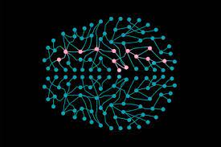

# Neural Network

<p align="center">
    
</p>

Implementing a basic **Backpropagition Neural Network** with the ability of customizing hidden layers and hidden nodes.

## How to use?
For example, let's train a model to predict the _OR_ operator values.
```python
# import the NerualNetwork class
from network.network import NeuralNetwork
```

After reading the example files, create the train and test sets:
```python
# test and train data
x_train, y_train = X[: int(len(X) / 2)], labels[: int(len(labels) / 2)]
x_test, y_test = X[int(len(X) / 2) :], labels[int(len(labels) / 2) :]
```

Training our model:
```python
# define our 2-2-1 neural network and train it
nn = NeuralNetwork([2, 2, 1], alpha=0.5)
nn.fit(x_train, y_train)
```

Results of our training:
```shell
[INFO] epoch=1, loss=244.7956431
[INFO] epoch=100, loss=281.8053128
[INFO] epoch=200, loss=289.7164039
[INFO] epoch=300, loss=293.0848939
[INFO] epoch=400, loss=427.1436566
[INFO] epoch=500, loss=435.9785757
[INFO] epoch=600, loss=439.6726859
[INFO] epoch=700, loss=441.9006606
[INFO] epoch=800, loss=443.4377500
[INFO] epoch=900, loss=444.5798144
[INFO] epoch=1000, loss=445.4703644
```

Testing our model:
```python
# now that our network is trained, loop over the output data points
for (x, target) in zip(x_test, y_test):
    # make a prediction on the data point
    pred = nn.predict(x)[0][0]
    step = 1 if pred > 0.5 else 0
```

Results of our testing:
```shell
[INFO] data=[0 1], ground-truth=0, pred=0.007755816965433578, step=0
[INFO] data=[0 1], ground-truth=0, pred=0.007755816965433578, step=0
[INFO] data=[0 0], ground-truth=0, pred=0.00010555090912274386, step=0
[INFO] data=[0 1], ground-truth=0, pred=0.007755816965433578, step=0
[INFO] data=[1 1], ground-truth=1, pred=0.9826684057919052, step=1
[INFO] data=[0 1], ground-truth=0, pred=0.007755816965433578, step=0
[INFO] data=[0 0], ground-truth=0, pred=0.00010555090912274386, step=0
[INFO] data=[0 1], ground-truth=0, pred=0.007755816965433578, step=0
[INFO] data=[0 1], ground-truth=0, pred=0.007755816965433578, step=0
[INFO] data=[0 1], ground-truth=0, pred=0.007755816965433578, step=0
[INFO] data=[1 0], ground-truth=0, pred=0.009488004818440726, step=0
[INFO] data=[0 1], ground-truth=0, pred=0.007755816965433578, step=0
[INFO] data=[0 1], ground-truth=0, pred=0.007755816965433578, step=0
[INFO] data=[1 1], ground-truth=1, pred=0.9826684057919052, step=1
[INFO] data=[1 0], ground-truth=0, pred=0.009488004818440726, step=0
[INFO] data=[1 1], ground-truth=1, pred=0.9826684057919052, step=1
[INFO] data=[1 0], ground-truth=0, pred=0.009488004818440726, step=0
[INFO] data=[1 0], ground-truth=0, pred=0.009488004818440726, step=0
[INFO] data=[1 1], ground-truth=1, pred=0.9826684057919052, step=1
[INFO] data=[1 0], ground-truth=0, pred=0.009488004818440726, step=0
[INFO] data=[0 0], ground-truth=0, pred=0.00010555090912274386, step=0
[INFO] data=[1 1], ground-truth=1, pred=0.9826684057919052, step=1
[INFO] data=[0 0], ground-truth=0, pred=0.00010555090912274386, step=0
[INFO] data=[1 0], ground-truth=0, pred=0.009488004818440726, step=0
[INFO] data=[0 1], ground-truth=0, pred=0.007755816965433578, step=0
[INFO] data=[1 0], ground-truth=0, pred=0.009488004818440726, step=0
[INFO] data=[0 0], ground-truth=0, pred=0.00010555090912274386, step=0
[INFO] data=[1 0], ground-truth=0, pred=0.009488004818440726, step=0
[INFO] data=[1 1], ground-truth=1, pred=0.9826684057919052, step=1
[INFO] data=[0 0], ground-truth=0, pred=0.00010555090912274386, step=0
[INFO] data=[1 0], ground-truth=0, pred=0.009488004818440726, step=0
[INFO] data=[0 1], ground-truth=0, pred=0.007755816965433578, step=0
[INFO] data=[1 1], ground-truth=1, pred=0.9826684057919052, step=1
[INFO] data=[1 1], ground-truth=1, pred=0.9826684057919052, step=1
[INFO] data=[1 1], ground-truth=1, pred=0.9826684057919052, step=1
[INFO] data=[1 1], ground-truth=1, pred=0.9826684057919052, step=1
[INFO] data=[0 1], ground-truth=0, pred=0.007755816965433578, step=0
[INFO] data=[0 1], ground-truth=0, pred=0.007755816965433578, step=0
[INFO] data=[1 1], ground-truth=1, pred=0.9826684057919052, step=1
[INFO] data=[0 1], ground-truth=0, pred=0.007755816965433578, step=0
[INFO] data=[1 1], ground-truth=1, pred=0.9826684057919052, step=1
[INFO] data=[1 1], ground-truth=1, pred=0.9826684057919052, step=1
[INFO] data=[1 0], ground-truth=0, pred=0.009488004818440726, step=0
[INFO] data=[1 0], ground-truth=0, pred=0.009488004818440726, step=0
[INFO] data=[1 1], ground-truth=1, pred=0.9826684057919052, step=1
[INFO] data=[1 1], ground-truth=1, pred=0.9826684057919052, step=1
[INFO] data=[1 1], ground-truth=1, pred=0.9826684057919052, step=1
[INFO] data=[1 0], ground-truth=0, pred=0.009488004818440726, step=0
[INFO] data=[0 0], ground-truth=0, pred=0.00010555090912274386, step=0
[INFO] data=[1 1], ground-truth=1, pred=0.9826684057919052, step=1
[INFO] result=50/50 accuracy=100.0%
```
